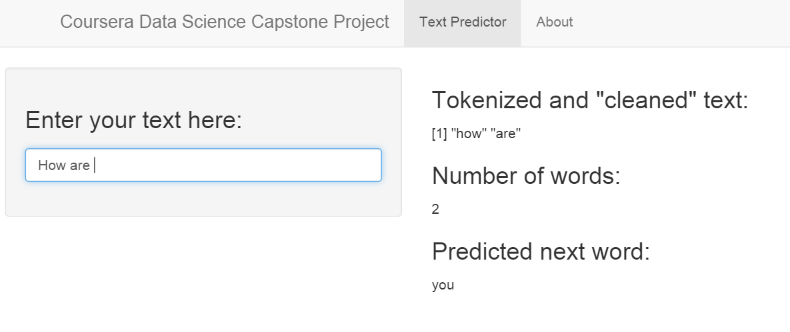

Data Science Capstone
========================================================
author: Edward Lim
date: 3 August 2015

Executive Summary
========================================================

For the Data Science Capstone project offered by Johns Hopkins University through Coursera, JHU partnered with SwiftKey a popular keyboard replacement app for mobile devices that uses predictive analytics to predict the next word a user types.

This presentation is part of the Data Science Capstone project. The objective of this project is to build a predictive text app such as SwiftKey. To build this engine, we use the data from [HC Corpora](http://www.corpora.heliohost.org) which contains a large number of sentences. 

For the Capstone project, the main goal is to build a Shiny application that is able to predict the next word.

Techniques Used
========================================================
To create the word prediction app, we took the following steps:

- From the HC Corpora dataset, we cleaned the data and then tokenize the data into n-grams. We created bigrams, trigrams and quadgrams.
- These n-grams are then stored in term freqency matrices.
- The matrices are then used to do word prediction.

How to Use the App
========================================================

***
When the app is launched, simply enter the text in the **Enter your text here:**. 

The predicted next word will be shown immediately together with the tokenized and "cleaned" text and the number of words you entered.

Additional Information
========================================================

The app is hosted on [ShinyApps.io](https://edwardlim.shinyapps.io/Coursera-DataScienceCapstone)

The R Presentation is available at [RPubs](http://rpubs.com/EdwardLim/CapstoneFinalPresentation).

Source code for ui.R and server.R files and the word prediction app are available in my [GitHub repository](https://github.com/EdwardLim/Coursera-DataScienceCapstone).

The interim milestone report is available [here](http://rpubs.com/EdwardLim/CapstoneMilestoneReport)

